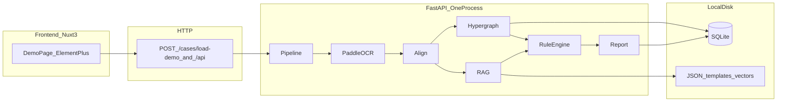
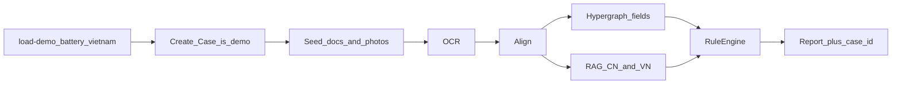
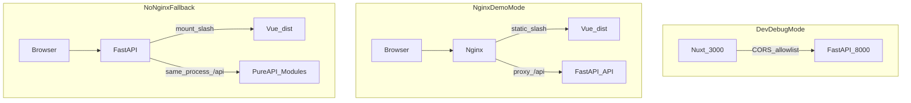
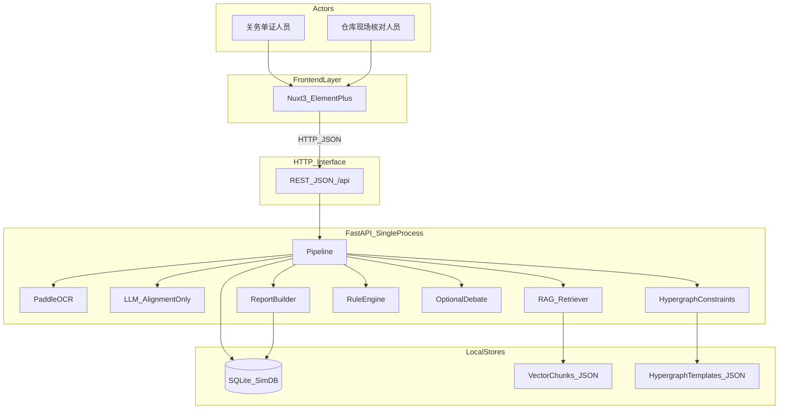
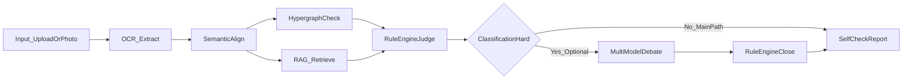
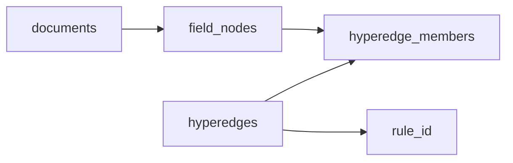
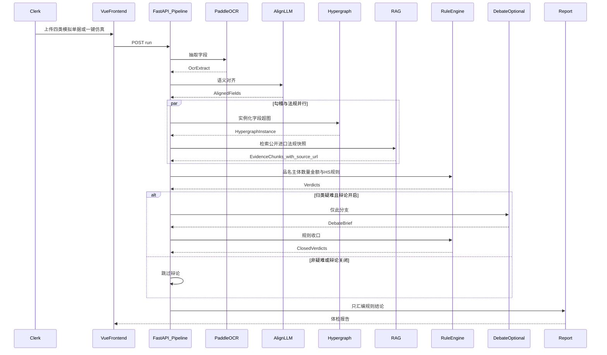
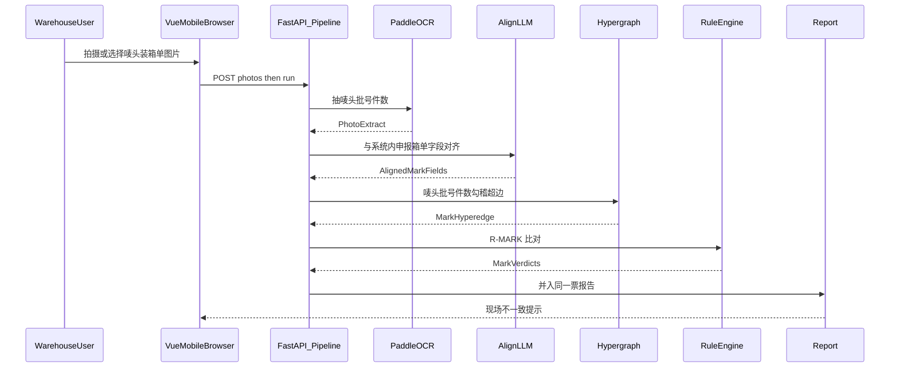

# 软件架构设计：关务慧眼｜出口货物海关申报自查系统

> 依据：[@docs/handoff.md](handoff.md)、[@docs/requirement-spec.md](requirement-spec.md)、[@docs/竞品分析.md](竞品分析.md)。仓库中若另有 [@docs/tech-stack.md](tech-stack.md)，以「前后端分离 + FastAPI 纯 API」与本文一致为准。  
> 精简总览见下方 §0；后文为展开。`POST /cases/load-demo` 约定见 §4.0.1。不含业务实现代码。  
> 定位：中小外贸企业**申报前自查工具**，不是海关监管系统。

---

## 0. 一页总览

单机一票仿真。Nuxt 只经 HTTP 调 FastAPI；OCR / 对齐 / 超图 / RAG / 规则 / 报告在**同一 Python 进程**。超图 = 单据字段勾稽，不是法规推理、不是企业团伙网。判定只出规则引擎。演示票：锂电池出口越南，`is_demo=true`。

### 0.1 系统架构



文字：浏览器 → Nuxt 3 演示页 → `POST /api/cases/load-demo`（或其它 `/api`）→ FastAPI 单进程 Pipeline → SQLite（业务表 + 超图三表）与本地 JSON（模板、法规快照、向量）。开发：Nuxt `:3000` + CORS。竞赛：Nginx 静态 + `/api` 反代。无 Nginx：FastAPI 挂静态。

### 0.2 模块划分与职责

| 模块 | 职责 | 不做什么 |
| --- | --- | --- |
| 前端（Nuxt 3 + Element Plus） | 三块 P0 分区、一键仿真、展示报告；D3 可选 | 原生 App、独立问答、管制筛查 |
| OCR | Paddle 抽字段；无权重则 fixture | 第二套 OCR、补造唛头 |
| 语义对齐 | LLM 映射字段槽；无密钥则预置映射 | 输出风险结论 |
| 超图 | 字段多对多勾稽实例化 | 企业图谱、法规推理 |
| RAG | 按 `jurisdiction` 检索公开法规快照 | 编造条文、通用聊天 |
| 规则引擎 | 唯一写 `verdict`：单单 + R-HS-CN/DEST + 唛头 | 把模型回复当结论 |
| 辩论 | 仅 HS 疑难且开关打开 | 主流程 |
| 报告 | 汇编规则结果 | 模型自由结论文本 |
| 存储 | `sqlite3` 业务+超图；JSON 模板/向量 | SQLAlchemy、Redis、Milvus、Neo4j |

无 User / 订单 / 聊天模块。一键仿真是 Case 工厂，不是独立资源。

### 0.3 核心业务流



一次请求内跑完：创建普通 Case → 灌仿真单据/照片 → OCR → 对齐 → **并行**超图勾稽与 RAG → 规则引擎 → 返回 `case_id` + 报告。前端自行展示该票（详情路由未定）。辩论默认关。不做出口管制 / 危化鉴定。

### 0.4 技术栈总表

| 层 | 采用 | 备注 |
| --- | --- | --- |
| 前端 | Nuxt 3、Element Plus、Axios、`nuxi generate` | D3 可选 |
| 后端 | FastAPI、Uvicorn、Pydantic、PaddleOCR、NumPy | 同进程，不上微服务 |
| LLM | OpenAI 兼容客户端 | 只对齐；无密钥则 fixture |
| 库 | SQLite + `sqlite3` | 业务表 + 超图三表；无 SQLAlchemy |
| 知识 | 本地 JSON 切片 / 向量 | 返回名称、日期、来源链接 |
| 开发 | CORS 白名单 `:3000` | 不开 Nginx |
| 演示 | Nginx 反代或 FastAPI 挂静态 | 禁止 Redis / 向量库 / 图库 / Stripe / Clerk |

---

## 1. 系统总体概述

**产品：** 关务慧眼，大学生竞赛用出口货物海关申报自查系统。

**目标用户**

- 主要用户：中小外贸企业关务 / 单证人员（电脑端申报前复核）。
- 次要用户：发货前 / 仓库现场核对人员（手机浏览器拍照，不替代电脑端制单）。
- 非用户：海关监管、缉私、风控人员。

**解决痛点（来自已有调研，不新增业务）**

- 单单不符：报关单、发票、合同等品名 / 主体一字之差导致退税驳回。
- 单证不符：HS 归类错误、申报要素（尤其材质成分）与税则不符。
- 单货不符：装柜现场唛头、批号、件数与申报 / 装箱单不一致。

**MVP 范围（只做 3 个核心功能）**

1. 单证交叉核对（单单相符）：OCR → 语义对齐 → 超图勾稽 → **规则引擎判定**。
2. HS 编码与申报要素纠错（单证相符）：RAG 检索**中国公开税则摘录 + 选定目的国官方进口规则**（均为官方公开快照）→ **规则引擎写出两条结论**（中国 HS 是否与中国税则一致；目的国进口规则是否另有限制），并附原文、法规名称、发布日期、来源链接。
3. 现场拍照核对（单货相符）：手机拍唛头 / 装箱单 → OCR → 与系统内申报数据比对唛头、批号、件数。

**增值（非主流程）：** 仅当规则引擎将归类标为「疑难」时，才触发多模型辩论；辩论结果必须交回规则引擎收口。关闭辩论时，主流程仍须输出带法规依据的 HS 纠错结论。

**P0 单据集合：** 报关单、增值税发票、装箱单、出口合同。收汇凭证不在本版本。

**明确不做：** 独立关务问答、企业团伙风险网络、监管侧能力、生产级部署、大模型直接输出风险结论；**禁止导入企业真实报关单据、海关内部非公开材料。**

---

## 2. 非功能需求（竞赛项目）

| 编号 | 类别 | 架构响应 |
| --- | --- | --- |
| NFR-01 | 可解释性 | 每条风险必须带：规则编号、证据字段 / 超边 ID、（归类时）法规原文摘录、法规名称、发布日期、官方来源链接。LLM 输出不得写入「最终判定」字段。 |
| NFR-02 | 演示易用性 | Nuxt 3 + Element Plus 演示；一键跑仿真案例；三个 P0 分区同页展示；手机浏览器拍照或选图，不开发原生 App。 |
| NFR-03 | 本地可运行 | 前后端分离、单机可答辩：开发走 Nuxt + FastAPI；竞赛走 Nginx 反代；无 Nginx 时降级由 FastAPI 挂载 Nuxt 静态产出。SQLite + 本地 JSON；不依赖云向量库、K8s、海关内网。 |
| NFR-04 | 低部署门槛 | 后端 `pip install` + 前端 `npm install`；PaddleOCR 权重未就绪时，仿真案例可读预置 OCR JSON，响应标明抽取来源，不换第二套 OCR 引擎。 |
| NFR-05 | 演示级性能 | 一份仿真案例（四类单据 + 现场照片）本地跑通即可；不承诺并发与全量税则。P1 辩论可关闭且允许更慢。 |
| NFR-06 | 数据与隐私 | 业务单证只用模拟仿真样本；法规库只用海外政府官方公开进口法律法规快照（非涉密）；禁止真实企业报关单与海关内部非公开材料；超图顶点是字段值，禁止企业—企业边。 |

---

## 3. 分层架构（C4 容器层）

MVP **采用前后端分离**：Nuxt 3 独立前端工程（Element Plus），FastAPI **纯 API** 后端。后端内部 **不做微服务拆分**，OCR / 对齐 / 超图 / RAG / 规则引擎 / 辩论 / 报告均在同一 Python 进程内以模块调用。无监管系统对接、无独立问答服务、无图数据库集群。

### 3.1 架构风格对比与选型

| 风格 | 形态 | 优点 | 缺点 | 本次 |
| --- | --- | --- | --- | --- |
| 单体 | FastAPI 同时渲染页面并处理业务，前后端代码缠在同一工程 | 启动份数少、无跨域、部署最省事 | Vue 无法独立工程化；热更新与组件库难用；答辩难以讲清分层 | **不采用** |
| 前后端分离 | `frontend/`（Nuxt 3 + Element Plus）独立；`backend/` 只暴露 HTTP JSON API；浏览器经 HTTP 调后端 | 前后端可并行开发；竞赛材料结构清晰；可用 Nginx 把演示做成「同源站点」；后端保持纯 API | 开发态两个端口，需处理 CORS；要比单体多一次构建 | **MVP 采用** |
| 微服务 | OCR、RAG、规则、报告各为独立进程 / 独立库，服务间再走 RPC | 可按模块扩缩、故障隔离 | 违背交接「轻量化、不做完整生产级部署」；调试、数据一致性和答辩环境成本过高 | **不落地**，仅作未来演进 |

**选型结论：** 系统级是前后端分离；后端进程级仍是「模块化单体」（modular monolith）。禁止把超图、RAG、规则引擎做成独立微服务。企业团伙分析、监管侧服务同样不在演进范围。

### 3.2 三种运行模式

| 模式 | 谁对浏览器暴露页面 | 谁提供 `/api` | 跨域？ | 用途 |
| --- | --- | --- | --- | --- |
| 开发调试模式 | Nuxt 开发服务器（如 `http://127.0.0.1:3000`） | FastAPI（如 `http://127.0.0.1:8000`） | **有跨域** | 日常改前端 / 改 API，热更新 |
| Nginx 竞赛演示模式 | Nginx 托管 Vue `dist`，监听 80（或演示端口） | Nginx 将 `/api` 反代到 FastAPI | **无跨域**（浏览器只看见 Nginx 一个源） | 答辩主推荐 |
| 无 Nginx 兜底降级模式 | FastAPI 额外挂载 `frontend/dist` 到 `/` | 同一 FastAPI 进程的 `/api` | **无跨域** | 赛场装不了 Nginx 时仍能一进程演示 |



约束：

- 三种模式 **不改变** 业务数据流，也不拆微服务。
- 降级模式里 FastAPI 只「顺便」提供静态文件，业务模块仍是纯 API；不得借此退回服务端模板单体。
- Nginx 模式不引入集群、HTTPS 证书中台、API 网关产品，只做静态 + 反代。

### 3.3 跨域解决方案

| 模式 | 方案 | 说明 |
| --- | --- | --- |
| 开发调试 | FastAPI `CORSMiddleware` 白名单 | 仅允许 Nuxt 源（如 `http://127.0.0.1:3000`、`http://localhost:3000`）。允许演示所需的 POST 上传与 JSON。**禁止** `allow_origins=["*"]` 配 `allow_credentials=true`。 |
| Nginx 竞赛演示 | 反向代理消掉跨域 | 浏览器源只有 Nginx。`/` → `frontend/dist`；`/api/` → `http://127.0.0.1:8000/api/`。前端 `baseURL` 用相对路径 `/api`。 |
| 无 Nginx 兜底 | 同源挂载 | 页面与 API 同端口，不触发 CORS。 |

前端约定：API 基址走环境变量（开发指向 `http://127.0.0.1:8000/api`，演示 / 兜底指向 `/api`），页面里不写死外网网关。

### 3.4 容器图（前后端分离）

浏览器只接触 Vue；Vue 只经 HTTP 调 FastAPI；模块之间是进程内调用，不是服务间 HTTP。



### 3.5 主数据流（与交接文档第 4 节一致）

主链路**必须**经过规则引擎。多模型辩论不在主链路上，只在规则引擎输出「归类疑难」之后作为旁路。



判定权约束：

- OCR / 对齐：产生结构化字段与映射候选，**不写风险等级**。
- 超图：产出「哪些字段被哪条勾稽约束连在一起」及约束求值所需的成员值，**不写最终风险结论**。
- RAG：产出法规原文块及来源链接 / 法规名称 / 发布日期，**不写是否错报**。
- 规则引擎：唯一写入 `verdict` / `risk_level` 的模块。
- 辩论：只允许输出带引用的结构化意见，禁止直接成为报告结论。

### 3.6 逻辑分层

| 层 | 职责 | 本版本内容 |
| --- | --- | --- |
| 前端独立层 | 上传、拍照、展示报告 | `frontend/` Nuxt 3 + Element Plus，经 HTTP 调 API |
| HTTP 接口层 | 唯一跨进程边界 | FastAPI 路由，JSON / 文件上传；**接口路径待确认后再定义** |
| 编排层 | 按固定流水线调用模块，禁止跳过规则引擎 | 同一 FastAPI 进程内的 pipeline |
| 理解层 | 抽取与对齐 | PaddleOCR、LLM 对齐 |
| 知识 / 约束层 | 并行提供依据与勾稽结构 | RAG、超图模板 |
| 判定层 | 硬约束收口 | 规则引擎（辩论仅疑难旁路） |
| 持久层 | 模拟业务、勾稽实例、法规切片 | SQLite + JSON |

模块间 **禁止** 再开端口相互 HTTP 调用（那将滑向微服务）。

### 3.7 未来演进（本次不落地）

仅当后续课程 / 二期明确要求时，才考虑把 OCR 或 RAG 拆成独立进程。本次竞赛 **不** 做服务发现、消息队列、多库分布式事务。演进也不得把超图改成企业团伙网络，不得引入监管侧服务。

---

## 4. 核心模块拆分

模块用**混合切分**（不是电商的用户 / 商品 / 订单 / 聊天）：

- **外层（给评委）：** 三个 P0 功能 + 报告展示。辩论不是外层功能。
- **内层（实现）：** 同一 FastAPI 进程里的流水线模块，功能之间复用，不复制三套 OCR。
- **API 层：** 按资源，不按功能各开一套控制器。一键仿真不是独立资源，见下表末行。

### 4.0 功能 × 流水线 × 资源对照

| 外层功能 | 会调用的内层流水线 | 资源 | 不包含 |
| --- | --- | --- | --- |
| 单证交叉核对 | OCR → 对齐 → 超图 → 规则（R-NAME / R-PARTY / R-QTY / R-AMT） | Case、Document | 用户账号、订单 |
| HS 与申报要素纠错 | 对齐字段、RAG（按 `jurisdiction` 过滤）、规则（R-HS-CN / R-HS-DEST）；疑难且开关打开才辩论 | Case、Document、KnowledgeChunk（只读 JSON） | 独立聊天 / 关务问答、出口管制清单 |
| 现场拍照核对 | OCR → 对齐 → 超图（唛头超边）→ 规则（R-MARK） | Case、Photo | 原生 App、危化出运鉴定 |
| 自查体检报告 | 只汇编规则引擎输出 | Report、RiskItem | 模型自由结论文本 |
| 一键仿真（工厂动作） | **先**创建普通 Case + 四类仿真 Document + 现场 Photo 种子，**再**走与上表相同的 `Pipeline`，不得另写一套校验 | 不新增 Demo 资源；动作：`POST /cases/load-demo` | 独立 demo 库、跳过规则引擎、出口管制筛查 |

共用编排器 `Pipeline`：一次自查可跑完三个外层功能，仍不算第四个业务模块。无 User / Product / Order / Chat 模块。

#### 4.0.1 `POST /cases/load-demo`（约定，未实现）

仅演示用途。生成的是**普通 Case**，另加临时演示标记（如 `is_demo=true`），不是第二种业务资源。

**请求体**

```json
{
  "demo_type": "battery-vietnam"
}
```

禁止在请求体中传入真实企业报关单或海关内部材料。MVP 只识别 `battery-vietnam`：请求体缺省或 `demo_type` 为空时**默认** `battery-vietnam`；其它未知值返回 400。

| 项 | 约定 |
| --- | --- |
| 路径 | `POST /cases/load-demo`（开发完整 URL：`http://127.0.0.1:8000/api/cases/load-demo`） |
| 行为 1 | 内部创建一条普通 Case |
| 行为 2 | 预置该演示对应的仿真单据（报关单 / 发票 / 箱单 / 合同）与现场照片样本 |
| 行为 3 | **同一请求内**自动触发已锁定的完整 `Pipeline`：OCR → 对齐 → **并行**超图勾稽（字段约束，不是法规推理）+ RAG 法规检索 → 规则引擎（单单 + R-HS-CN/DEST + 唛头）。辩论默认关 |
| 行为 4 | 响应含新建 `case_id` 与本票报告；`verdict` 只来自规则引擎。前端用 `case_id` 进入该票详情（跳转是前端行为，API 不负责重定向） |
| 失败 | 未知 `demo_type`、种子缺失或流水线异常时不得假装通过；OCR 无权重则 `source=fixture` |
| 明确不做 | 不跳过规则引擎；不扫描出口管制清单；不做危化出运鉴定；不把「超图」做成法规推理或企业图谱 |

`load-demo` **不得**调用 `POST /cases`。业务空票走 `POST /cases`（`case_no` 唯一，`pending`，`is_demo=false`），再上传、再 `run`。演示票也必须写入 `case_no`。`destination_country` 为空时 R-HS-DEST 只能是 `insufficient_evidence`。

契约细节见 [@docs/api.md](api.md)。

### 4.0.2 模块边界与流水线交互

不重画架构图。只划清「谁可以写什么」。

| 模块 | 只允许输出 | 禁止输出 |
| --- | --- | --- |
| OCR | 结构化字段、`ocr_source` | 任何 `verdict` / 风险等级 |
| 语义对齐 | 规范槽位与映射记录 | `verdict`、法规条文 |
| 超图 | 顶点 / 超边 / 成员取值（勾稽结构） | `verdict`、数量「是否违规」的最终句 |
| RAG | 命中的公开条文、`chunk_id`、来源链接、候选编码片段 | 最终 HS 该不该报、`R-HS-*` 结论 |
| 规则引擎 | **唯一** `verdict`、`rule_outcome`、`R-HS-CN` / `R-HS-DEST`、单单与唛头结论 | 编造未检索到的法规 |
| 辩论 | 带引用的意见材料 | `final_verdict` |
| 报告 | 汇编规则已写出的项 | 自行改判定 |
| `load-demo` | 自建 Case + 种子 + 调用同一 Pipeline | 当作第二种判定引擎；调用 `POST /cases` |

流水线顺序（进程内函数调用，不是微服务 HTTP）：**OCR → 字段对齐 →（超图勾稽 ∥ RAG 检索）→ 规则引擎 → 写 `check_reports` / `risk_items` / 超图三表**。

前端只打资源接口：Case（含空票、`run`、`load-demo`、**只读** `/hypergraph`）、Document、Photo、Report / RiskItem。不直接调 OCR/RAG/规则的内部函数。`/hypergraph` 属于 Case 子资源，不是第五个业务模块。

模块之间只传结构数据（字段、超边、条文块）。「最终对错」只出现在规则引擎之后。

### 4.0.3 Case 票次状态机

状态只允许四种：`pending` / `running` / `completed` / `failed`。  
`insufficient_evidence` **不是**票状态，只允许出现在 `risk_items.rule_outcome`（例如未填 `destination_country` 时的 R-HS-DEST）。图见 [@docs/process/flow-diagrams.md](process/flow-diagrams.md) §3。

#### 枚举说明

| 状态 | 含义 | 进入条件 | 该状态下允许的事 | 出口 |
| --- | --- | --- | --- | --- |
| `pending` | 空票或已有材料、尚未跑完 Pipeline | 业务：`POST /cases` 成功插入 | 上传/查看单据与照片；调用 `POST /cases/{id}/run` | `run` 开始 → `running` |
| `running` | 本请求内正在执行同一条 Pipeline | `run` 或 `load-demo` 已通过校验并开始编排 | 只允许流水线写库；拒绝并发第二个 `run` | 成功 → `completed`；未捕获失败 → `failed` |
| `completed` | Pipeline 正常结束并已落报告 | 规则引擎已写出本票 `risk_items`（其中可以全是 `pass`，也可以含 `fail`/`warning`/`insufficient_evidence`） | 读报告、超图快照；允许 `POST /run`（force）重跑 | 重跑 → `running` |
| `failed` | Pipeline 异常结束，**不得**写假 `pass` | OCR/对齐/写库抛错且无法 fixture 降级；或种子缺失 | 可读票与已上传文件；允许 `POST /run` 重试 | 重试 → `running` |

`completed` 只表示「流水线跑完」，不表示「单证全部相符」。整票风险看 `summary_verdict` 与风险项。

#### 两条链路的差异

| | 业务链路 | 演示链路 `load-demo` |
| --- | --- | --- |
| 进入 | `POST /cases` → **`pending`**（客户端可见） | **不调用** `POST /cases`；插入后立刻进入 `running`，客户端几乎看不到 `pending` |
| 上传 | 多次 `POST documents/photos`，**不改** `status` | 内部灌种子，无独立上传请求 |
| 触发校验 | 必须再 `POST /cases/{id}/run` | 同一请求内自动跑 Pipeline |
| 结束 | `completed` 或 `failed` | 同左；成功响应带 `case_id` + 报告 |
| 失败且尚未建票 | `POST /cases` 参数错误则无行 | 未知 `demo_type` → 400，**不插入** Case |
| 失败且已建票 | `run` 异常 → 该票 `failed`，行保留 | 种子/流水线异常 → 该票 `failed`（已插入则保留），响应 500，不写通过结论 |

#### 状态流转表

| 当前 | 触发事件 | 目标 | 说明 |
| --- | --- | --- | --- |
| （无） | `POST /cases` 成功 | `pending` | `is_demo=false`，无报告 |
| （无） | `POST /cases/load-demo` 且 `demo_type` 合法 | `running` | 内部插入演示票后立即编排 |
| `pending` | 上传 Document / Photo | `pending` | **禁止**因上传而变为 `running` |
| `pending` | `POST /cases/{id}/run` | `running` | 无任何材料 → 400，状态仍为 `pending` |
| `running` | Pipeline 正常结束（含 DEST 依据不足） | `completed` | 规则项可以是 `insufficient_evidence` |
| `running` | Pipeline 抛错且无降级 | `failed` | 不写 `summary_verdict=pass` |
| `running` | 再次 `POST /run` 或 `load-demo` | （不变） | 400，禁止并发 |
| `completed` | `POST /run`（force） | `running` | 覆盖本票报告与超图三表 |
| `failed` | `POST /run` | `running` | 重试同一条 Pipeline |
| `completed` / `failed` | 再上传文件 | 状态不变 | 新文件要等下一次 `run` 才进入校验 |

#### 禁止的跳转与异常回退

禁止：

- `pending` → `completed`（跳过 `running`，等于没跑规则引擎）
- `pending` → `failed`（建票或上传失败用 HTTP 错误，不把空票标失败，除非曾经进入过 `running`）
- 任意状态 → 自定义第五态（含把 `insufficient_evidence` 写成 `cases.status`）
- `failed` → `completed` 且不跑 Pipeline（人工改判定）
- PATCH 接口直接改 `status` / `verdict`

异常回退：

- `run` 已置 `running`，中途失败：回写 `failed`，保留已上传文件；超图/报告以本轮是否写完为准，不得残留上一轮的 `pass` 冒充本轮成功。
- `load-demo` 在插入前失败（未知类型）：无行、400。
- `load-demo` 在插入后失败：行留在 `failed`，500。
- fixture 降级（无 Paddle 权重）仍算 Pipeline **成功路径** → `completed`，`ocr_source=fixture`，不是 `failed`。

### 4.1 OCR 解析模块（paddle-ocr）

| 项 | 说明 |
| --- | --- |
| 职责 | 从扫描件 / 照片抽取文本行，再切出候选字段。唯一 OCR 引擎为 PaddleOCR。 |
| 输入 | 单据图片或现场照片；仿真案例可附带 `mark_ocr.json` 作为权重未就绪时的对照抽取。 |
| 输出 | `OcrExtract`：原文行、字段候选（品名、主体、数量、金额、HS、成分、唛头、批号、件数等）、置信度、`source=paddle|fixture`。 |
| 技术 | PaddleOCR；禁止引入第二套 OCR。不得补造未识别出的唛头 / 批号。 |
| 不做 | 不做真伪鉴定、残损评估。 |

### 4.2 语义对齐模块

| 项 | 说明 |
| --- | --- |
| 职责 | 把不同单据上的近义字段名与近义表述映射到统一字段槽（如「境内发货人」与「销售方」→ `party_seller`）。只做理解，不做判定。 |
| 输入 | 多份 `OcrExtract` 或已结构化的仿真 JSON。 |
| 输出 | `AlignedFields`：规范字段名、来源单据、原始值、归一候选、对齐记录。**不含 risk_level。** |
| 技术 | OpenAI 兼容 LLM（环境变量配置）。无密钥时：仅返回该仿真案例预置映射候选，保证演示可跑。 |
| 不做 | 禁止输出「存在风险 / 允许申报 / 违法」；禁止编造法规条文。 |

### 4.3 超图勾稽网络模块

| 项 | 说明 |
| --- | --- |
| 职责 | 用超图表达**一张或多张单据上多个字段之间的一条勾稽约束**（超边连接 ≥2 个字段顶点）。只处理单据字段多对多勾稽，**不是企业关系网**。 |
| 输入 | `AlignedFields` + 勾稽模板（品名、主体、数量、金额、唛头批号件数）。 |
| 输出 | `HypergraphInstance`：顶点列表、超边列表、每条超边的成员字段取值。数量例：发票数量、箱数、每箱数量、报关数量四点共边，约束为 `invoice_qty = pkgs × per_pkg` 且与报关数量一致。 |
| 技术 | 模板 JSON + SQLite 实例表（见第 5.2 节）。不引入 Neo4j / 企业图谱产品。 |
| 顶点 | `(case_id, document_id, field_name, field_value)`。 |
| 超边 | `(constraint_id, constraint_type, rule_id)`，类型仅限字段勾稽。 |
| 禁止出现的边 | 企业—企业、法人—企业、历史处罚团伙、股权、报关行关联。 |

### 4.4 RAG 法规知识库模块

| 项 | 说明 |
| --- | --- |
| 职责 | 按品名、材质成分、申报 HS 检索官方公开法规快照，为规则引擎提供原文依据。切片必须带 `jurisdiction`（`CN` 或目的国代码）。独立问答入口不存在。 |
| 输入 | 查询文本（品名 + 成分 + HS）+ 本票目的国。 |
| 输出 | `EvidenceChunks[]`：`chunk_id`、`jurisdiction`、相关 HS、`regulation_name`、`publish_date`、`source_url`、原文、相似度。未命中则空列表，禁止假条文或假链接。检索须能按管辖过滤，避免中外条文混排成一条「对错」。 |
| 技术 | **仍为**本地 JSON 切片 + 预计算向量，进程内余弦检索。不改用 Milvus / 云向量库。 |
| 不做 | 不做通用关务聊天；不接入海关内部非公开材料；不导入真实企业报关单。 |

### 4.5 规则引擎模块（风险判定核心）

| 项 | 说明 |
| --- | --- |
| 职责 | **唯一**允许写入风险结论的模块。硬约束优先。 |
| 输入 | `AlignedFields`、`HypergraphInstance`、`EvidenceChunks`；若辩论开启，另收 `DebateBrief`（意见 + 引用，不是结论）。 |
| 输出 | `RuleVerdicts[]`：`rule_id`、`passed|failed|hard|insufficient_evidence`、`risk_level`、证据字段、超边 ID、法规 chunk ID。 |
| 技术 | 确定性规则（Python 规则表即可，无需 Drools 集群）。 |
| P0 规则族 | R-NAME 品名冲突；R-PARTY 主体归一后比对；R-QTY 数量恒等式；R-AMT 金额勾稽自洽（非估价）；**R-HS-CN** 申报 HS vs 中国公开税则；**R-HS-DEST** 目的国官方进口规则是否另有限制；R-MARK 唛头 / 批号 / 件数。两条 HS 结论都由规则引擎写，禁止模型合并成一句总判定。 |
| 疑难谓词（触发 P1 的唯一入口） | R-HS-CN：相邻子目均高相关且关键要素跨界。R-HS-DEST：同一目的国检索到至少两条互相冲突的官方公开条文。未满足则不得调用辩论。 |
| 不做 | 不把 LLM 回复当 `verdict`；不做价格异常模型、出口管制、团伙评分。 |

### 4.6 多模型辩论模块（仅归类疑难分支）

| 项 | 说明 |
| --- | --- |
| 职责 | 增值演示。仅由规则引擎 `hard` 标记触发。把多方带引用意见整理成结构化材料，**交回规则引擎收口**。 |
| 输入 | 疑难标记、品名、成分、申报 HS、RAG 原文块。 |
| 输出 | `DebateBrief`：各方观点、所引用 chunk ID。无 `final_verdict` 字段。 |
| 技术 | 可选的第二 / 第三 OpenAI 兼容端点；配置开关 `DEBATE_ENABLED`，**演示默认 `false`**，仅讲解归类疑难时打开。关闭或失败时跳过本模块。 |
| 不做 | 不进入主流程图；不以投票代替规则；辩论关闭时 HS 主流程仍须出报告。 |

### 4.7 报告输出模块

| 项 | 说明 |
| --- | --- |
| 职责 | 把规则引擎结论汇编为自查体检报告，供网页展示与 SQLite 落库。 |
| 输入 | 仅 `RuleVerdicts` + 展示用的对齐字段、超边、法规摘录、（可选）辩论材料。 |
| 输出 | `CheckReport`：案例 ID、风险等级汇总、风险项列表（规则编号、证据、法规原文）、抽取来源、是否触发辩论。 |
| 技术 | 服务端模板化 JSON / HTML 片段，无独立报告微服务。 |
| 约束 | 报告结论字段必须来自规则引擎。辩论材料如展示，须标注「非最终判定」。 |

### 4.8 前端交互模块（网页 + 手机拍照演示）

| 项 | 说明 |
| --- | --- |
| 职责 | 竞赛演示交互：电脑端上传四类单据并跑自查；手机端拍照 / 选图做现场核对；同页三个功能分区 + 一键仿真案例。 |
| 输入 | 用户文件、摄像头图像、演示按钮。 |
| 输出 | 调用后端 API，渲染报告（字段、超边、风险项、法规摘录及来源链接）。 |
| 技术 | 独立 Nuxt 3 + Element Plus（竞赛用静态生成，不把 SSR 接到 FastAPI）。勾稽默认用表格展示；**D3 可选**，仅电脑端画**当前票**字段超图，手机拍照页不画。不做原生 App。 |
| 文案 | 只写「申报前自查」。禁止「监管」「团伙」「企业画像」。页脚：演示工具，不构成法律意见。锂电池票须明示：**不做出口管制筛查、不给出运/危化鉴定**，只做 HS 归类依据、单证勾稽与唛头核对。 |
| 不做 | 不提供独立问答对话框；不对接单一窗口申报提交。 |

**HTTP 接口清单不在本文展开。** 待你确认本节架构选型后再单独定义（路径、请求体、错误码）。 |

---

## 5. 数据存储设计

三类存储都只服务自查演示，不含监管主题库。

### 5.1 向量库（RAG 法规库）

演示采用**文件型向量库**，避免额外服务：

| 文件 | 内容 |
| --- | --- |
| `data/knowledge/hs_tariff_chunks.json` | 中国公开税则摘录 + 选定目的国官方进口规则快照：`chunk_id`、`jurisdiction`、`hs_code`、`regulation_name`、`publish_date`、`source_url`、`issuing_body`、`text` |
| `data/knowledge/embeddings.json` | 与 `chunk_id` 对应的预计算向量（**仍不进 SQLite、不上 Milvus**） |

逻辑结构：

```text
KnowledgeChunk
  chunk_id, jurisdiction, hs_code, regulation_name, publish_date, source_url, issuing_body, text
  embedding  →  仅存 embeddings.json，按 chunk_id 对齐
```

约束：每条结果必须带官方来源链接与 `jurisdiction`；体积为女裤演示所需的中国税则摘录 + **1～2 个目的国**公开文本，不宣称全球覆盖。**不存**海关内部非公开材料。存储形态不变：JSON 向量 + SQLite。

### 5.2 超图存储（单据-字段-勾稽关系）

**模板（静态）** `data/hypergraph/constraint_templates.json`：约束类型、成员字段槽、规则表达式、绑定的 `rule_id`。

**实例（SQLite）** 每次自查物化一版，便于报告引用超边 ID：

| 表 | 含义 | 关键字段 |
| --- | --- | --- |
| `field_nodes` | 超图顶点 = 某单据字段取值 | `node_id`, `case_id`, `document_id`, `field_name`, `field_value` |
| `hyperedges` | 一条勾稽约束 | `edge_id`, `case_id`, `constraint_type`, `rule_id` |
| `hyperedge_members` | 超边包含哪些顶点 | `edge_id`, `node_id`, `slot_name` |



数量勾稽示例（四点超边，不是两两企业连边）：

```text
e_qty: { invoice.qty, packing.pkgs, packing.per_pkg, declaration.qty }
constraint: invoice.qty == packing.pkgs * packing.per_pkg
            AND invoice.qty == declaration.qty
```

### 5.3 业务模拟数据库（SQLite）

文件建议：`data/app.db`。全部为仿真业务对象。

| 表 | 用途 |
| --- | --- |
| `cases` | 一票自查（模拟出口票） |
| `documents` | 报关单 / 增值税发票 / 装箱单 / 出口合同的文件或结构化 JSON |
| `photos` | 现场唛头 / 箱单照片及 OCR 来源 |
| `check_reports` | 体检报告头：等级汇总、是否疑难、是否调用辩论 |
| `risk_items` | 报告明细：`rule_id`、结论、证据 JSON、`edge_id`、`chunk_id` |

单据结构化字段（可存 JSON 列，实现阶段再拆列）：品名、境内发货人 / 销售方、数量、金额、HS、材质成分、唛头、批号、件数。不含企业股权、关联公司、历史处罚名单。

仿真案例目录：`data/samples/case_battery_vn/`（合成：主体差二字、数量勾稽失败、锂电池 HS 差错、唛头批号不符；目的国越南）。与真实企业报关数据隔离。不做管制名单扫描。

---

## 6. 关键业务数据流

HS 纠错与单证交叉核对共用一次「跑自查」编排，但判定入口不同：前者走 RAG + R-HS，后者走超图 + R-NAME / R-PARTY / R-QTY / R-AMT。下面按任务要求给出两条核心流程。

### 6.1 流程① 单证交叉核对（含并行的 HS 纠错）

对应需求 UC-01 + UC-02。参与者：关务 / 单证人员。



失败策略：OCR 缺失 → 规则按字段缺失出项；RAG 未命中 → `insufficient_evidence`，禁止编造条文；辩论失败 → 保留疑难前的规则结论。

### 6.2 流程② 现场拍照核对

对应需求 UC-03。参与者：仓库现场核对人员（关务亦可）。前置：该票模拟申报 / 箱单已在系统内。



本流程**默认不走 RAG、不走辩论**（辩论只服务归类疑难）。现场只核唛头、批号、件数。无系统内申报数据时中止，不进入「海关查验」叙事。

两条流程可在同一 `case_id` 汇合为一份报告，便于答辩展示「单单 + 单证 + 单货」闭环，仍不是第四个功能模块。

---

## 7. 技术选型汇总表

| 关注点 | 选型 | 理由（竞赛 + 交接约束） |
| --- | --- | --- |
| 后端 | Python + FastAPI | 轻量、与 PaddleOCR 同语言、单进程可演示 |
| 前端 | Nuxt 3 + Element Plus | 竞赛演示组件齐全；手机浏览器即可拍照 / 选图；仍非原生 App；不替代 FastAPI |
| OCR | PaddleOCR（唯一） | 交接指定开源方案 |
| 语义对齐 | OpenAI 兼容 LLM | 只做字段理解；无密钥时用仿真映射 |
| 勾稽 | 超图模板 JSON + SQLite 实例 | 字段多对多约束；不做企业图谱 |
| 法规 RAG | 本地 JSON 切片 + 预计算向量 + 内存余弦 | 海外政府公开进口法规快照；返回名称 / 日期 / 来源链接；免云向量库 |
| 判定 | 自研规则表（规则引擎） | 硬约束优先，唯一结论出口 |
| 辩论 | 可选多端点 LLM | 仅 `hard` 分支；可关闭 |
| 业务库 | SQLite | 模拟报关单 / 报告，零运维 |
| 系统架构 | 前后端分离 | Vue 独立前端 + FastAPI 纯 API；对比见 §3.1 |
| 后端进程形态 | 模块化单体 | OCR/RAG/规则等同进程；微服务不落地 |
| 开发联调 | Nuxt + CORS 白名单 | 见 §3.2、§3.3 |
| 竞赛演示 | Nginx 静态 + `/api` 反代 | 浏览器同源，无跨域 |
| 兜底演示 | FastAPI 挂载 `dist` | 无 Nginx 时仍可本地演示 |
| 部署规模 | 本地单机 | 不做生产级集群、不做微服务网格 |
| 数据 | 仿真业务单证 + 官方公开法规 JSON 快照 | 禁止真实企业报关单与海关内部非公开材料 |

前后端分离已定。不得因此增加功能模块，不得把后端拆成微服务，不得改变「规则引擎判定」原则。

---

## 8. 风险与约束说明

### 8.1 数据为模拟数据（业务单证）+ 公开法规快照（RAG）

- 演示票、公司名、报关单 / 发票 / 箱单 / 合同均为**虚构仿真样本**，结构可参考公开处罚案例形态（女裤子目、主体差二字、数量不符等），**不是**真实企业报关单复制件。
- RAG 法规库为海外各国政府官方公开渠道发布的进口商品法律法规**快照摘录**（非涉密），每条附 `source_url`、法规名称、发布日期，用于「给依据」演示。
- OCR 对照 JSON 仅服务仿真案例在无权重机器上的可运行性。
- **存储不变：** RAG 向量仍用本地 JSON；业务与超图实例仍用 SQLite。

### 8.2 隐私与合规约束

- **禁止导入企业真实报关单据、海关内部非公开材料**（未公开函件、内部归类裁定、真实舱单 / 查验记录 / 查验影像）。
- 日志与数据库不得保存真实身份证、海关注册编码与未公开合同。
- 超图存储审计：表结构只有 `document_id` + `field_*`，若出现企业关联字段即视为越界。
- 产品文案与报告标题使用「自查」「风险提示」，不使用「立案」「监管指令」「企业黑名单」。

### 8.3 法规快照与免责声明

1. **法规为快照版本：** 知识库在演示打包时固化。不承诺与各国政府网站实时同步。若用于商用，必须建立定期同步更新机制（拉取官方公开文本、重算向量、记录快照日期），本次竞赛不实现该同步管道。
2. **免责声明：** 本系统仅为大学生竞赛 / 申报前自查**演示工具**，输出的风险提示与法规摘录**不构成法律意见、不构成正式归类裁定、不替代持证报关或律师意见**。用户须自行核对官方来源链接上的现行有效文本。

### 8.4 技术与竞赛风险

| 风险 | 约束性应对 |
| --- | --- |
| LLM 幻觉写成结论 | 报告 `verdict` 仅规则引擎可写；接口层丢弃模型判定句 |
| 把超图做成风控图谱 | 模板白名单只有字段勾稽类型 |
| 辩论变成主流程 | 默认关闭或仅 `hard` 触发；关闭后验收仍须通过 HS 报告 |
| Paddle 环境重 | 仿真案例允许 `source=fixture`，引擎标识仍为 Paddle 方案 |
| 范围蔓延 | 不实现需求规格第 7 节 Out-of-Scope 清单 |

### 8.5 架构边界（防止下一步概要设计越界）

允许进入概要设计的包：`ocr`、`align`、`hypergraph`、`rag`、`rules`、`debate`（旁路）、`report`、`frontend`、SQLite/JSON 存储。  
不允许新增的包：问答机器人、团伙图谱、估价模型、单一窗口申报、用户权限中台、原生 App。

---

## 9. 系统潜在性能瓶颈与应对策略

本节**不改动**已锁定选型：FastAPI 单进程、PaddleOCR、OpenAI 兼容 LLM、本地 JSON 向量、SQLite 超图表、Nuxt 3 + Element Plus。应对分两列：**竞赛 Demo 现状**（本次必须可落地）与 **未来生产演进**（不在 MVP 实现）。概率按「单次跑通仿真案例时，最容易拖长等待」排序。

### 9.1 主要瓶颈（按概率从高到低）

| 序 | 瓶颈 | 触发场景 | 现象 | 竞赛 Demo 现状（本次采用） | 未来生产演进（本次不落地） |
| --- | --- | --- | --- | --- | --- |
| 1 | 大模型推理（语义对齐；P1 辩论更重） | 每次 `/run` 要对齐四类单据字段；讲解疑难归类时打开 `DEBATE_ENABLED` 会再调 2～3 个端点 | 接口在对齐阶段长时间无响应；若辩论开启，报告延迟成倍；无密钥或超时则整票失败 | ① 辩论默认关闭，主流程不经过辩论。② 无密钥 / 超时时走仿真案例预置对齐映射，不阻塞规则引擎。③ 对齐只返回字段候选，禁止让模型「再写一遍报告」。④ 可设短超时，超时降级为预置映射 | 生产可对对齐结果按票缓存、批量字段一次请求、专用推理卡；辩论仍仅疑难分支。不把 LLM 做成判定服务，也上不了 Redis 当结论库 |
| 2 | PaddleOCR 识别 | 上传扫描件或现场照片；首次加载检测 / 识别权重；CPU 笔记本上连跑多图 | 首张图等待数十秒；CPU 打满；赛场未下好权重则直接失败 | ① 唯一引擎仍是 PaddleOCR，不换第二套。② 女裤仿真案例可读 `mark_ocr.json`，响应标 `source=fixture`，保证答辩可跑。③ 演示优先用预置结构化 JSON 单据，照片张数控制在唛头 + 箱单。④ 权重预下载进演示包，避免现场拉网 | 生产可 GPU 推理进程、页级并发队列；仍不得引入第二种 OCR。可对同一影像做结果缓存。拆 OCR 独立进程属于架构「未来演进」，本次不拆微服务 |
| 3 | JSON 向量暴力检索 | HS 纠错时对 `embeddings.json` 做全量余弦；法规切片增多或向量维数偏高 | RAG 阶段随切片数线性变慢；内存一次性载入全部向量 | ① 切片规模锁在女裤演示可讲解条数，启动时载入内存扫一遍即可。② 可先按 HS 前缀 / 品名关键词缩小候选再点积。③ 未命中直接 `insufficient_evidence`，禁止用 LLM 补搜。④ 不上 Milvus / Chroma | 切片到万级以上再迁 `pgvector` 或 Milvus；商用须定期同步官方公开文本并重算向量。本次不改 JSON 存储 |
| 4 | 超图内存计算 | 一次自查按模板实例化顶点 / 超边；规则引擎遍历成员求值 | 模板暴涨或一张单字段过多时构图与校验变慢；内存上升 | ① 模板白名单只有品名、主体、数量、金额、唛头批号件数等 P0 约束。② 一票字段量级为演示单据，三表写入 SQLite 后内存只保留当前票。③ 超边求值是确定性算术 / 比对，不做图算法扩散。④ 不用 Neo4j | 生产仍建议关系表存字段超图；仅当勾稽模板极多时再考虑专用图查询，且**只存字段顶点**，不得迁成企业团伙网 |

### 9.2 次要瓶颈

| 序 | 瓶颈 | 触发场景 | 现象 | 竞赛 Demo 现状（本次采用） | 未来生产演进（本次不落地） |
| --- | --- | --- | --- | --- | --- |
| 5 | SQLite | 连续多次 `/run` 写 `field_nodes` / `hyperedges` / `risk_items`；答辩机机械硬盘 | 偶发卡顿；极少出现锁等待（单演示员、单进程） | ① 单连接、单票写入，不设连接池集群。② 报告读当前 `case_id`，不做全库分析查询。③ WAL 可选，非必须。④ 不引入 Redis 当缓冲 | 多用户并发时迁 PostgreSQL（表结构可平移）。不以 SQLite 当向量库或会话中心 |
| 6 | 前端 D3 渲染 | 答辩若用 D3 把当前票的勾稽超图画成力导向图（仅可视化已有 `field_nodes` + `hyperedges`，**不是新业务模块，也不改存储**） | 节点一多就掉帧；手机端拍照页卡顿 | ① 默认用 Element Plus 表格 / 描述列表展示超边与风险即可，D3 为可选讲解层。② 若启用 D3：只画**当前票**、节点上限为本次单据字段数，禁止一次渲染历史全库。③ 手机现场核对页不画力导向图，只提示唛头 / 批号 / 件数。④ 不引入 WebGL 图谱产品 | 生产可视化可分页、按约束类型切换子图；仍禁止画企业关系网。高并发渲染走独立静态资源 CDN，与 API 无关 |

### 9.3 竞赛可感知时延预期（非生产 SLA）

| 阶段 | Demo 可接受 | 说明 |
| --- | --- | --- |
| 一键仿真（对齐走预置映射、OCR `fixture`、辩论关） | 数秒内出报告 | 答辩主路径，优先保证 |
| 真 Paddle + 真 LLM 对齐、辩论关 | 数十秒级可讲解「正在抽取 / 对齐」 | 须有进度文案，不得假死 |
| 打开多模型辩论 | 允许明显慢于主路径 | 可关闭；失败则回退规则结论 |

不承诺并发 QPS、全量法规检索或实时同步各国官网。

### 9.4 总结

竞赛路径上，等待时间几乎一定先来自**大模型**和 **PaddleOCR**，其次才是本地 JSON 的一次全量点积和当前票超图求值；SQLite 与前端 D3 只在反复落库或把勾稽图画得很炫时才会被感觉到。因此 Demo 用「辩论默认关、OCR/对齐可 fixture、法规切片控制规模、超图只物化 P0 模板、列表优先于大图」压住时延，**不为此更换 FastAPI、Paddle、JSON 向量或 SQLite**。生产侧才考虑 GPU OCR、向量库、PostgreSQL 和受控的超图可视化，并且演进不得把超图做成团伙网络，也不得让 LLM 直接输出风险结论。

---

## 10. 已确认项与待确认问题

### 10.1 已确认

- 后端：**Python FastAPI 纯 API**；内部模块同进程，**不拆微服务**。
- 前端：**独立 Nuxt 3 + Element Plus**；手机访问同一页，不做原生 App。不采用 Next.js API / Supabase / Redis / Stripe / Flutter。
- 系统架构：**前后端分离**（单体页面方案与微服务方案均不作为 MVP）。
- 运行模式：开发调试（Nuxt `:3000` + CORS）／ Nginx 竞赛演示／ 无 Nginx 时 FastAPI 挂载 Nuxt 静态产出兜底。
- 辩论：演示默认 `DEBATE_ENABLED=false`，仅讲解归类疑难时打开；关闭时主流程仍须输出带依据的 HS 纠错报告。
- RAG：本地 JSON + 预计算向量；切片含 `jurisdiction`。中国公开税则摘录 + 1～2 个目的国官方进口规则快照。规则引擎分写 **R-HS-CN** 与 **R-HS-DEST**，不引入 Chroma / Milvus。业务单证仅为仿真样本。
- 超图：模板 JSON + SQLite 三张表；电脑端可用 D3 画当前票，表格为主，手机拍照页不画。不用 Neo4j。
- OCR：Paddle 为唯一引擎；权重缺失时仿真案例可读预置 JSON，响应标明 `source=fixture`。
- 仿真案例：主票改为**锂电池 / 新能源出口越南**，仍合成一票打三个 P0（主体差二字、数量勾稽、HS 纠错、唛头批号）。女裤不再作为主演示。法规快照 = 中国公开税则摘录 + 越南官方公开进口规则摘录。
- 辩论：R-HS-CN 或 R-HS-DEST 均可标 hard，但 DEST 仅当检索到**至少两条互相冲突的官方公开条文**才 hard；辩论默认关。本票**不实现出口管制清单筛查**（仍为 P2 / Out-of-Scope）。

### 10.2 请确认后再定义接口

请审核 §9 性能瓶颈表（概率排序、Demo / 生产两列、未改选型）。**回复「架构通过」后才定义 HTTP 接口**，确认前不写接口文档、不写业务实现代码。

建议端口：Nuxt `3000`、FastAPI `8000`；竞赛 Nginx `80` 或 `8080`。
