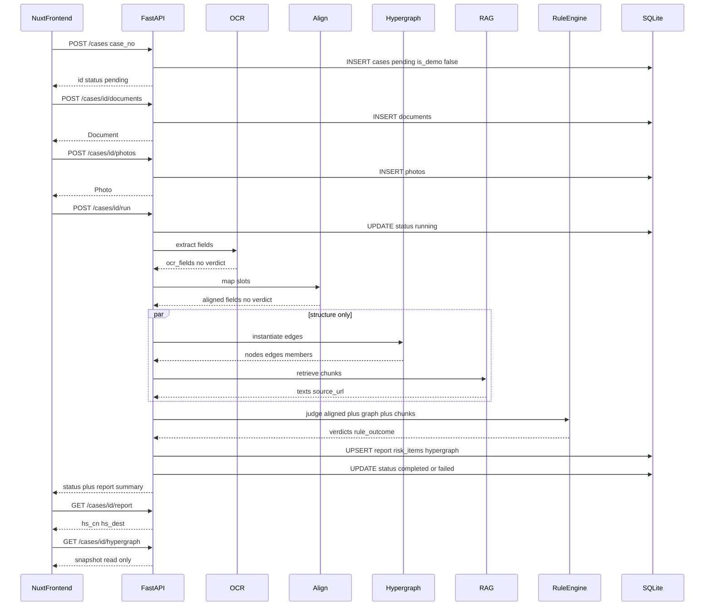
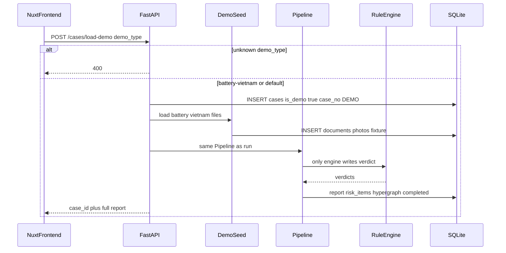
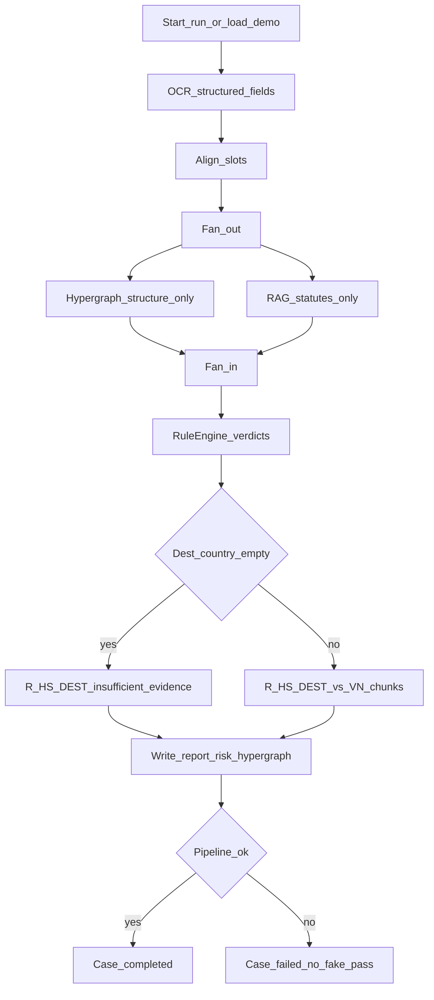
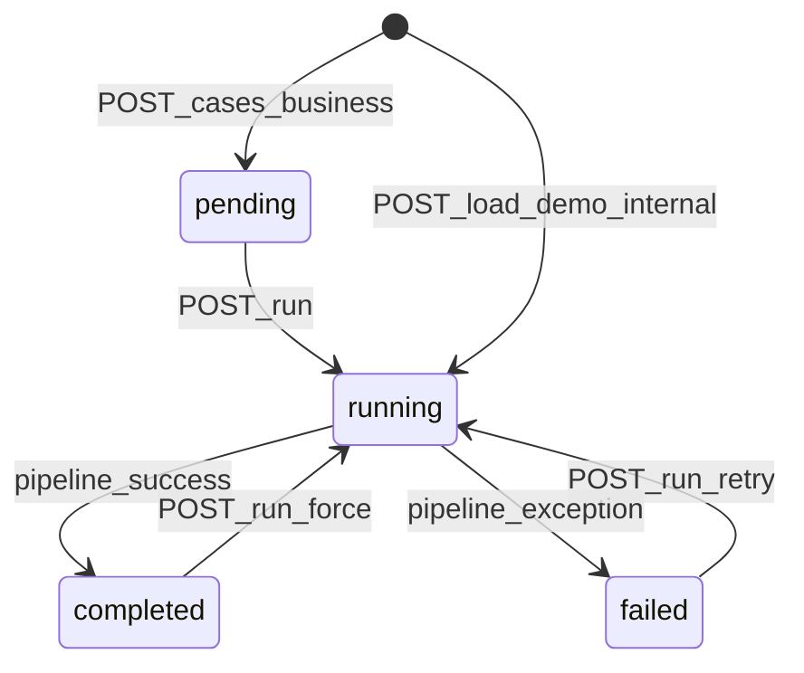

# 流程图（Mermaid）

依据：[@docs/api.md](../api.md)、[@docs/architecture.md](../architecture.md)。  
只描述约定，不实现代码。可直接在支持 Mermaid 的 Markdown 里渲染。

## 已拍板的画法

1. **「活动图」**：Mermaid 没有标准 UML Activity，用 `flowchart` 表达流水线。
2. **时序图**：业务 + 演示两张都保留。
3. **状态机**：允许 `completed`/`failed` 经 `POST /run`（含 force/重试）回到 `running`。
4. **`load-demo` 与 `pending`**：客户端几乎看不到 `pending`；图中 `[*] --> running` 表示演示入口，业务入口仍是 `[*] --> pending`。

模块边界（图中已遵守）：超图/RAG/OCR **不写** `verdict`；只有规则引擎出判定。

---

## 1. 时序图

### 1.1 业务链路：建票 → 上传 → run → 报告

### 1.2 演示链路：仅 `POST /cases/load-demo`（不调用 `POST /cases`）

---

## 2. 流水线活动（flowchart，非 UML Activity）

`destination_country` 为空时，规则引擎对 R-HS-DEST 给出 `insufficient_evidence`，不编造条文。整票 `status` 仍可以是 `completed`。

---

## 3. Case 状态机

票状态只有四档：`pending` / `running` / `completed` / `failed`。  
`insufficient_evidence` 不是票状态，只出现在 `risk_items.rule_outcome`。

上传单据/照片 **不改变** `status`（仍为 `pending`，直到 `run`）。
